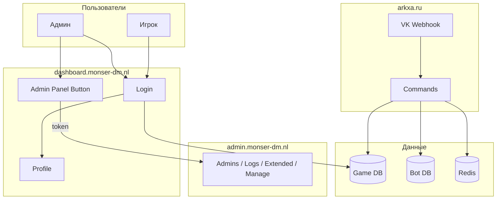

# Monser Dashboard документация

Личный кабинет SAMP-серверов Monser DM. Backend (Laravel) и фронтенд (Vue). Точка входа для админ-панели.

**Связанные проекты:** [Arkasha Bot](../../arkxa.ru/docs/) — VK-бот для бесед администрации.

---

## Содержание

- [Обзор системы](overview.md) — схема, связь dashboard, admin, бота
- [Админ-панель](admin-panel.md) — редирект, unlock, разделы
- [API](api.md) — endpoints, throttle
- [Деплой](deployment.md) — env, CORS, Sanctum

---

## Схема системы

